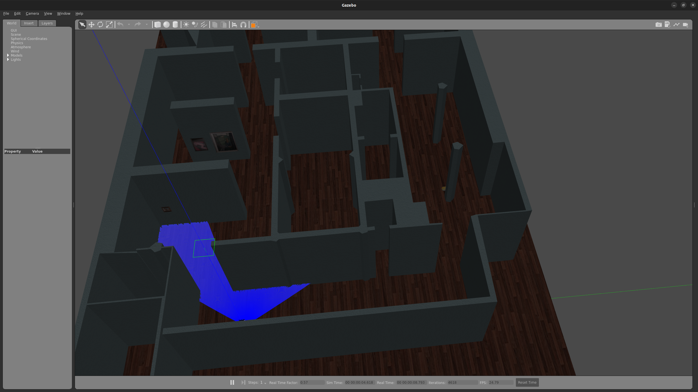
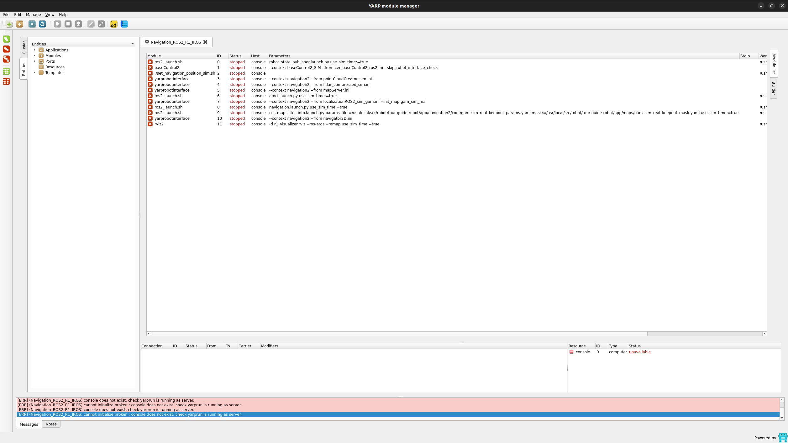
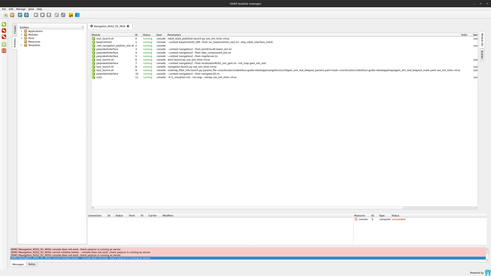

<h1 align="center">
    IROS 2025 - Code Generation and Monitoring for Deliberation Components in Autonomous Robots
</h1>


## Table of Contents

- [Updates](#updates)
- [Reproduce the results](#reproduce-the-paper-results)
- [License](#license)

## Updates

2025-03-17 added working example

 ## Reproduce the paper results

 to run the code you need docker installed 

 then 
 ```
 cd laboratory-tour/docker
 docker compose pull
 sudo xhost +
 docker compose up environment 
 ```
The first thing you need to check is that gazebo should start correctly, you need to see a window like this one:



after this some windows will open, you need to find yarpmanager:

then start all the application from 0, leaving 2 or 3 seconds after each (it needs to be green)

after that you will be in this situation:



once started, you need to go back to the terminal and start the oracles. 

```
docker compose up run_oracles
```

then wait 30 seconds till the oracles starts correctly

after that start the system 

```
docker compose up run_all_monitors
```

-----------------------------------


to drop the battery level below 30% you need to type in the terminal that prompts from the docker:

```
yarp rpc /fakeBattery/rpc

```

and then in the prompt:

```
setBatteryCharge 22
```

 ### Monitor Results

 to see the results of the monitor, from the `laboratory-tour/docker` folder run the following commands:

 |**Monitor**|**line to put**|
|:---:|:---:|
|Monitor Property 1| docker logs --follow ros2monitorProp1 |
|Monitor Property 2| docker logs --follow ros2monitorProp2 |
|Monitor Property 3| docker logs --follow ros2monitorProp3 |
|Model Monitor Alarm Skill | docker logs --follow ros2oracleAlarmFSM|
|Model Monitor Battery Level Skill| docker logs --follow ros2oracleBatteryLevelFSM |
|Model Monitor Is Poi Done 1 Skill| docker logs --follow ros2oracleIsPoiDone1FSM |
|Model Monitor Set Poi 1 Skill| docker logs --follow ros2oracleSetPoi1FSM |


 ### Tests as in Paper

 #### T1
 
 Edit line 184 of `docker-compose.yml` with:

```yarpmanager-console --application $${UC3_DIR}/launch/applications/convince_bt_skills_T1.xml --exit --run --connect"```

then run all as above, and once done you should see in the `Model Monitor Battery Level Skill` a **Timed Out** log that means it hasn't received the expected message.

Instead once you drop the battery level you should see in the `Monitor Property 2` a **"verdict": "currently_false"** that means it has an inconsistency.


#### T2


 Edit line 184 of `docker-compose.yml` with:

```yarpmanager-console --application $${UC3_DIR}/launch/applications/convince_bt_skills_T2.xml --exit --run --connect"```

then run all as above, and once done you should see in the `Model Monitor Set Poi 1 Skill` a **Timed Out** log that means it hasn't received the expected message.


 #### T3
 
 Edit line 184 of `docker-compose.yml` with:

```yarpmanager-console --application $${UC3_DIR}/launch/applications/convince_bt_skills_T3.xml --exit --run --connect"```

then run all as above, and once done you should see in the `Model Monitor Battery Level Skill` a **currently_false** log that means the behavior is not as expected.

Instead once you drop the battery level you should see in the `Monitor Property 1` a **"verdict": "currently_false"** that means it has an inconsistency.


 #### T4
 
 Edit line 184 of `docker-compose.yml` with:

```yarpmanager-console --application $${UC3_DIR}/launch/applications/convince_bt_skills_T4.xml --exit --run --connect"```

then run all as above, and once you drop the battery level you should see in the `Model Monitor Alarm Skill` a **currently_false** log that means it hasn't received the expected message (at the first tick).

 #### T5
 
 Edit line 184 of `docker-compose.yml` with:

```yarpmanager-console --application $${UC3_DIR}/launch/applications/convince_bt_skills_T5.xml --exit --run --connect"```

then run all as above, and once you drop the battery level you should see in the `Model Monitor Battery Level Skill` a **currently_false** log that means the behavior is not as expected and `Monitor Property 2` a **"verdict": "currently_false"** that means it has an inconsistency.


 #### T6
 
 Edit line 184 of `docker-compose.yml` with:

```yarpmanager-console --application $${UC3_DIR}/launch/applications/convince_bt_skills_T6.xml --exit --run --connect"```

then run all as above, and once done you should see in the `Model Monitor Is Poi Done 1 Skill` a **currently_false** log that means the behavior is not as expected.


## Maintainer

This repository is maintained by:

| | |
|:---:|:---:|
| [](https://github.com/hsp-iit) | [@hsp-iit](https://github.com/hsp-iit) |

